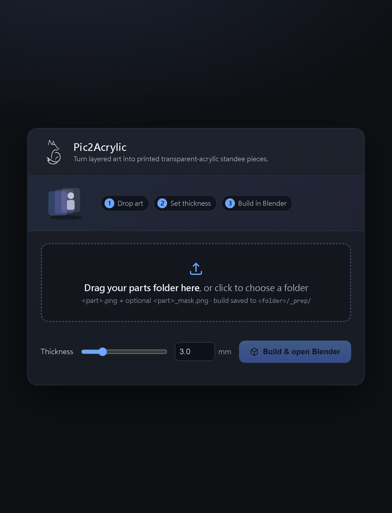

# Pic2Acrylic

Turn layered artwork into **printed transparent-acrylic standee pieces** you can
preview in Blender — before sending anything to an acrylic print shop.

## What it does

- Traces each part's **mask** into an SVG cut-shape (the artwork stays raster, so no
  detail is lost).
- Builds each piece in Blender as **transparent acrylic + an alpha-gated printed layer**:
  opaque where there's art, clear acrylic where there isn't.
- Keeps every piece on one shared coordinate frame, so the printed image lands **1:1**
  on its cut-shape and the layers stay aligned.

## Quick start

1. Run **`web-ui.bat`** (installs dependencies on first run, opens the UI).
2. Drag your **parts folder** in (or click to choose one) — it holds `<part>.png`
   plus an optional `<part>_mask.png` for each piece.
3. Set the **thickness (mm)** and click **Build** — it opens Blender with the standee
   assembled (layers fanned apart) and writes a self-contained `acrylic.blend` into a
   **`_prep` subfolder of your folder**.

> Folder drag + writing the `.blend` back into your folder uses the browser's File
> System Access API — use a Chromium browser (Edge/Chrome) and allow write access when
> prompted. All parts must share the same canvas pixel size (keeps them aligned).

## How it works

Two stages, because mask tracing needs OpenCV (which Blender's Python lacks):

| Stage | Script | Runtime |
|---|---|---|
| Trace masks → SVG + manifest | `prep_masks.py` | system Python 3 |
| Assemble acrylic in Blender   | `build_acrylic.py` | Blender (`bpy`) |

You can also run them by hand or via `build-acrylic.bat` (drag a folder onto it).
Key tunables (env vars or top of `build_acrylic.py`): `THICKNESS_MM`, `HEIGHT_MM`,
`GAP_MM`, `FLIP_V`.

## Requirements

- Python 3 (`opencv-python-headless`, `pillow`, `numpy`, `flask` — auto-installed)
- Blender (5.0 tested; found via `BLENDER_PATH`, `PATH`, Program Files, or Steam)
